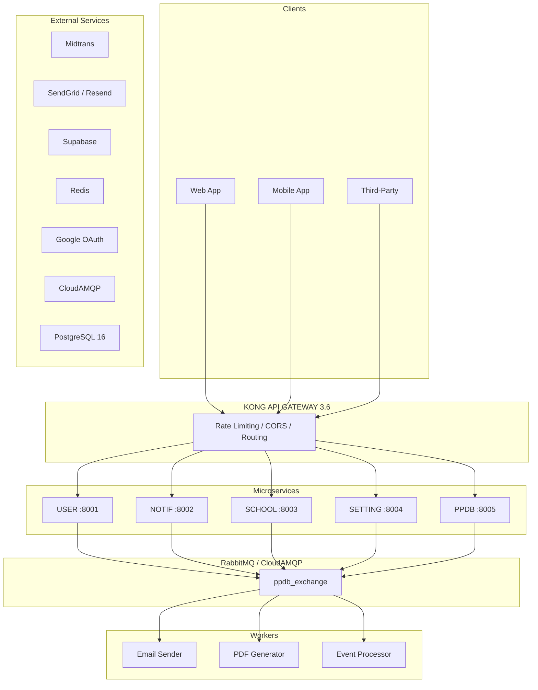
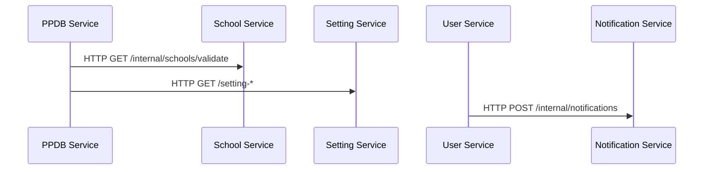
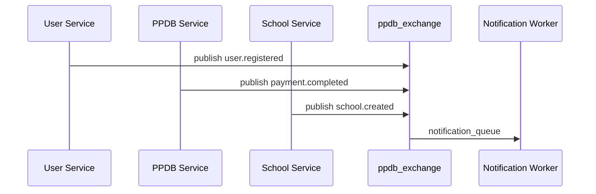
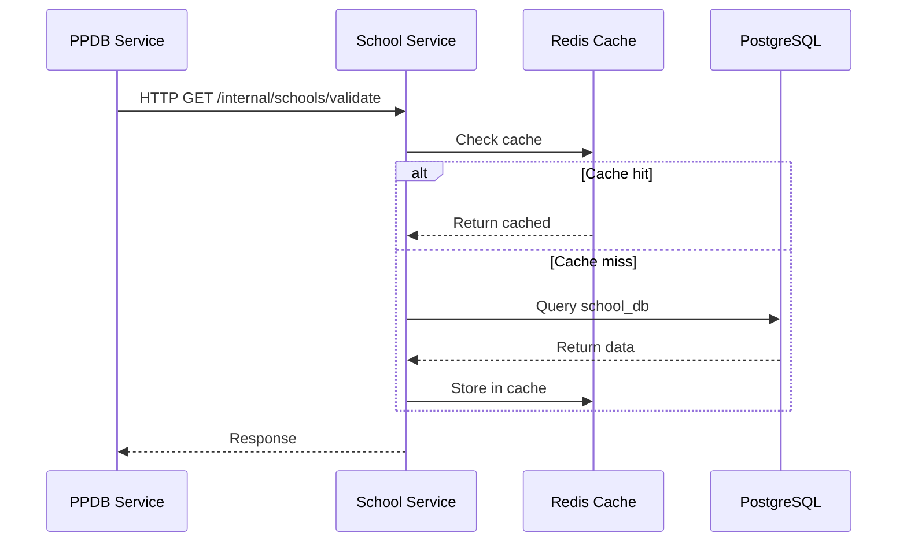
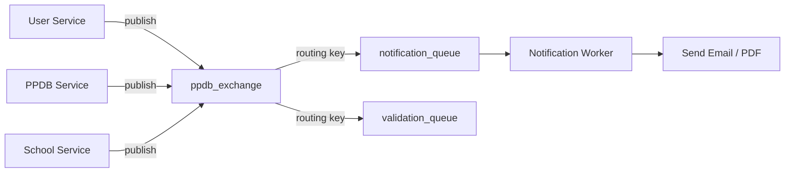
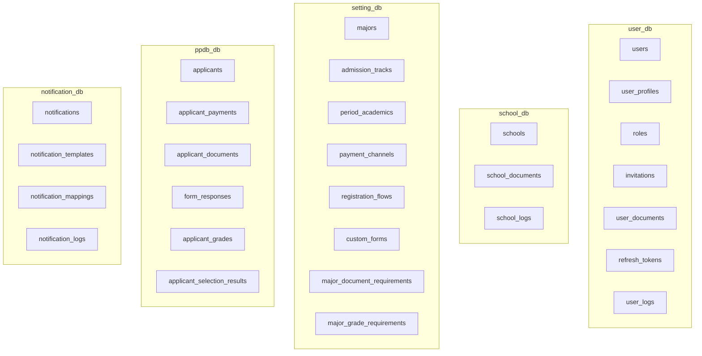
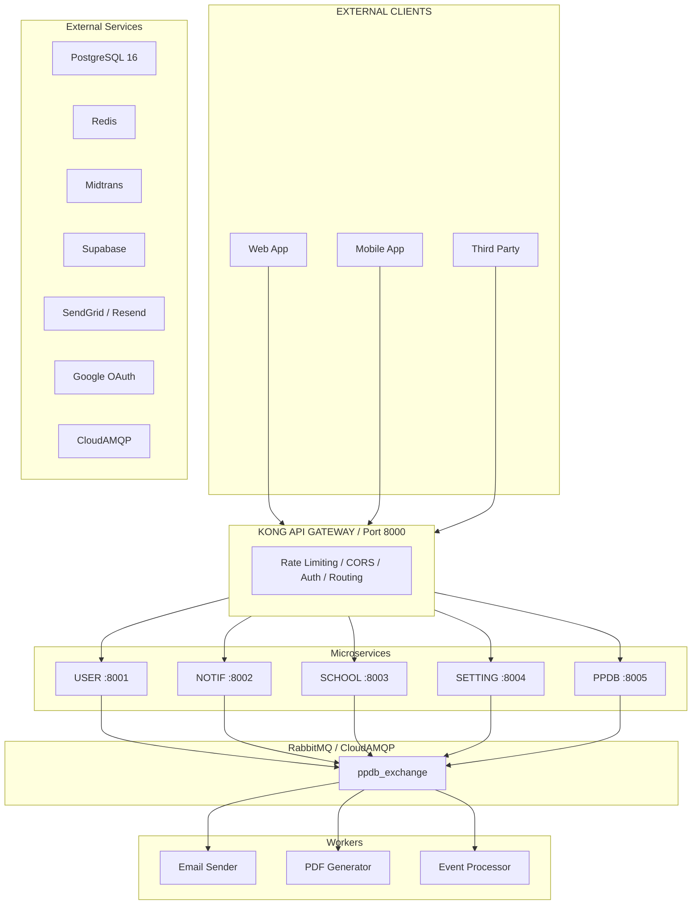

# PPDB Platform — Sistem Penerimaan Peserta Didik Baru Berbasis Microservices

> Sistem backend microservices untuk pengelolaan penerimaan siswa baru secara menyeluruh — mencakup autentikasi, manajemen sekolah, konfigurasi jalur pendaftaran, proses pendaftaran peserta didik, dan pengiriman notifikasi.


*Arsitektur sistem PPDB berbasis microservices*

---

## Table of Contents

- [Ringkasan Proyek](#ringkasan-proyek)
- [Arsitektur Sistem](#arsitektur-sistem)
- [Microservices](#microservices)
  - [User Service (Port 8001)](#user-service-port-8001)
  - [Notification Service (Port 8002)](#notification-service-port-8002)
  - [School Service (Port 8003)](#school-service-port-8003)
  - [Setting Service (Port 8004)](#setting-service-port-8004)
  - [PPDB Service (Port 8005)](#ppdb-service-port-8005)
- [Technology Stack](#technology-stack)
- [Infrastructure & Deployment](#infrastructure--deployment)
- [Inter-Service Communication](#inter-service-communication)
- [API Gateway (Kong)](#api-gateway-kong)
- [Database Design](#database-design)
- [CI/CD Pipeline](#cicd-pipeline)
- [Getting Started](#getting-started)
- [Dokumentasi Pendukung](#dokumentasi-pendukung)

---

## Ringkasan Proyek

**PPDB Platform** adalah sistem backend yang dibangun untuk mendukung proses **Penerimaan Peserta Didik Baru (PPDB)** di berbagai institusi pendidikan. Sistem ini dirancang dengan pendekatan **microservices architecture** yang memungkinkan setiap domain bisnis berjalan secara independen, mudah di-scale, dan mudah dimaintain.

Proyek ini mendukung **3 peran pengguna utama**:

| Peran | Deskripsi |
|-------|-----------|
| **Superadmin** | Pengelola platform tingkat pusat — mengelola sekolah, role, template notifikasi, dan konfigurasi global |
| **Admin Sekolah** | Pengelola operasional PPDB per sekolah — verifikasi pendaftar, pembayaran, seleksi, dan laporan |
| **Calon Peserta Didik** | Pengguna akhir — registrasi mandiri, upload dokumen, pembayaran, dan pengecekan hasil |

**Fitur utama yang didukung:**
- Autentikasi multi-provider (JWT + Google OAuth)
- Multi-tenant: satu platform melayani banyak sekolah secara terisolasi
- Konfigurasi dinamis: jalur pendaftaran, jurusan, periode, formulir, dan alur registrasi
- Pembayaran via Midtrans (termasuk webhook handling)
- Upload dokumen dengan Supabase Storage
- Notifikasi berbasis template (email via SendGrid/Resend, realtime)
- PDF generation untuk dokumen hasil seleksi
- Rate limiting dan CORS via API Gateway

---

## Arsitektur Sistem



### Alur Komunikasi Antar Service

#### Synchronous (HTTP Request-Response)



#### Asynchronous (RabbitMQ / CloudAMQP)



---

## Microservices

### User Service (Port 8001)

Manajemen autentikasi dan profil pengguna.

**Tech:** Flask 3.1.0 + gevent, SQLAlchemy 2.0, PostgreSQL, Redis, RabbitMQ, SendGrid, Google OAuth, JWT

**Responsibilities:**
- Autentikasi via Google OAuth 2.0
- JWT token management (access + refresh tokens)
- CRUD profil pengguna
- Sistem role & invitation untuk admin sekolah
- Upload dokumen pengguna ke Supabase
- User activity logging
- Session management via refresh tokens

**Key Routes:**
```
POST /api/v1/auth/google              # Google OAuth login
POST /api/v1/auth/refresh             # Refresh access token
GET  /api/v1/user-profile             # Get current user profile
PUT  /api/v1/user-profile             # Update profile
POST /api/v1/invitations              # Invite staff/admin
GET  /api/v1/roles-users              # Role assignment
POST /api/v1/user-document/upload     # Document upload
GET  /api/v1/internal/users/{id}      # Internal service call
```

**Database:** `user_db`
> Tabel: `users`, `user_profiles`, `roles`, `invitations`, `user_documents`, `user_logs`, `refresh_tokens`

---

### Notification Service (Port 8002)

Manajemen notifikasi, template, dan event-to-template mapping.

**Tech:** Flask 3.1.0 + gevent, SQLAlchemy 2.0, PostgreSQL, RabbitMQ, Resend (email), ReportLab (PDF)

**Responsibilities:**
- Template-based notification system
- Event-to-template mapping (configurable per event type)
- Email delivery via Resend (per-school sender: `school_slug.noreply@domain.com`)
- Realtime notification via SSE/polling
- PDF generation untuk dokumen hasil seleksi
- Notification logging & delivery tracking

**Key Routes:**
```
GET  /api/v1/notifications             # List notifications
POST /api/v1/notifications             # Create notification
GET  /api/v1/templates                 # List templates
POST /api/v1/templates                 # Create template
GET  /api/v1/template-mappings          # Event-to-template map
POST /api/v1/template-mappings          # Map event → template
```

**Database:** `notification_db`
> Tabel: `notifications`, `notification_templates`, `notification_mappings`, `notification_logs`

**Workers:**
- `email_sender_service` — consumes queue → sends email via Resend
- `pdf_generator_service` — generates PDF attachment for selection results

---

### School Service (Port 8003)

Manajemen data sekolah dan dokumen sekolah.

**Tech:** Flask 3.1.0 + gevent, SQLAlchemy 2.0, PostgreSQL, RabbitMQ, SendGrid, Supabase

**Responsibilities:**
- CRUD data sekolah (multi-tenant)
- Upload dan verifikasi dokumen sekolah
- School-level configuration
- Validasi sekolah via internal API (dipanggil oleh service lain)
- School activity logging

**Key Routes:**
```
GET  /api/v1/schools                   # List schools
POST /api/v1/schools                   # Create school
GET  /api/v1/schools/{id}              # Get school detail
PUT  /api/v1/schools/{id}              # Update school
POST /api/v1/school-documents          # Upload school document
GET  /api/v1/internal/schools/validate # Internal validation endpoint
```

**Database:** `school_db`
> Tabel: `schools`, `school_documents`, `school_logs`

---

### Setting Service (Port 8004)

Pusat konfigurasi platform — jalur pendaftaran, jurusan, periode, formulir, dan channel pembayaran.

**Tech:** Flask 3.1.0 + gevent, SQLAlchemy 2.0, PostgreSQL, RabbitMQ, SendGrid

**Responsibilities:**
- Master data: jurusan/program studi
- Konfigurasi jalur pendaftaran (Jalur Zonasi, Afirmasi, Prestasi, dll.)
- Periode akademik
- Payment channel management (seeded dari Midtrans)
- Registration flow steps (langkah-langkah pendaftaran dinamis)
- Custom forms (formulir tambahan per sekolah)
- Document/grade/physical requirements per major

**Key Routes:**
```
GET  /api/v1/setting-majors                           # List jurusan
GET  /api/v1/setting-admission-tracks                 # List jalur pendaftaran
GET  /api/v1/setting-period-academic                  # List periode
GET  /api/v1/setting-payment-channels                 # List payment methods
GET  /api/v1/setting-registration-flow                # Registration steps
GET  /api/v1/setting-custom-forms                     # Dynamic forms
GET  /api/v1/setting-track-document-requirements      # Doc requirements
GET  /api/v1/setting-major-document-requirements      # Doc per major
GET  /api/v1/setting-major-grade-requirements          # Grade requirements
```

**Database:** `setting_db`
> Tabel: `majors`, `admission_tracks`, `period_academics`, `payment_channels`, `registration_flows`, `custom_forms`, `major_document_requirements`, `major_grade_requirements`, `major_physical_requirements`, `track_document_requirements`

---

### PPDB Service (Port 8005)

Service inti — mengelola seluruh alur pendaftaran peserta didik baru.

**Tech:** Flask 3.1.0 + gevent, SQLAlchemy 2.0, PostgreSQL, RabbitMQ, SendGrid, Midtrans, Supabase

**Responsibilities:**
- Pendaftaran dan manajemen pendaftar
- Verifikasi kelengkapan dokumen
- Pembayaran via Midtrans (termasuk webhook handler)
- Input nilai: tes mengaji, tes fisik, nilai akademik
- Proses seleksi dan penentuan hasil kelulusan
- Announcement / pengumuman hasil
- Upload dokumen peserta didik

**Key Routes:**
```
GET  /api/v1/applicants                    # List applicants
POST /api/v1/applicants                    # Create applicant registration
GET  /api/v1/applicants/{id}               # Applicant detail
PUT  /api/v1/applicants/{id}               # Update applicant

POST /api/v1/payment                       # Initiate payment
GET  /api/v1/payment/{id}                  # Get payment status
POST /api/v1/webhook                       # Midtrans payment callback

POST /api/v1/applicant/documents           # Upload applicant document
GET  /api/v1/applicant/documents/{id}       # Get uploaded documents

POST /api/v1/form-responses                # Submit form answers
GET  /api/v1/grade-responses               # Input/view grades
POST /api/v1/grade-responses               # Submit grades (tes mengaji/fisik)

POST /api/v1/selection-result              # Announce selection result
GET  /api/v1/selection-result/{applicant_id}# Get result
```

**Database:** `ppdb_db`
> Tabel: `applicants`, `applicant_user_details`, `applicant_documents`, `applicant_payments`, `form_responses`, `applicant_grades`, `applicant_physical`, `applicant_status_history`, `applicant_selection_results`

---

## Technology Stack

| Layer | Technology | Purpose |
|-------|-----------|---------|
| **Framework** | Flask 3.1.0 + gevent | Async-capable HTTP server per service |
| **ORM** | SQLAlchemy 2.0 + Flask-SQLAlchemy | Database abstraction |
| **Migrations** | Alembic + Flask-Migrate | Schema versioning |
| **Database** | PostgreSQL 16 | Per-service database (5 total) |
| **Message Broker** | RabbitMQ / CloudAMQP | Async event bus |
| **Cache** | Redis | Inter-service cache (cache-aside) |
| **API Gateway** | Kong 3.6 | Rate limiting, CORS, routing |
| **Auth** | JWT (PyJWT) + Google OAuth 2.0 | User authentication |
| **Email** | SendGrid, Resend | Transactional email |
| **Payment** | Midtrans | Payment gateway |
| **Storage** | Supabase (PostgreSQL + Storage) | File uploads |
| **PDF** | ReportLab | PDF generation |
| **Container** | Docker + Docker Compose | Containerization |
| **CI/CD** | GitLab CI/CD | Automated testing & build |
| **Testing** | pytest + pytest-flask | Unit & integration tests |

---

## Infrastructure & Deployment

### Local Development

```yaml
# docker-compose.yml (root)
services:
  # Databases
  postgres:       { image: postgres:16, port: 5432 }
  postgres-kong:  { image: postgres:15, port: 5433 }

  # Infrastructure
  rabbitmq:      { image: rabbitmq:3-management, port: 15672 }
  kong-db:       { service: postgres-kong }
  kong:          { image: kong:3.6, port: 8000 }

  # Services (API + Worker per service)
  user-service-api:       { port: 8001 }
  user-service-worker:    {}
  notification-service-api:{ port: 8002 }
  notification-service-worker:{}
  school-service-api:     { port: 8003 }
  school-service-worker:  {}
  setting-service-api:    { port: 8004 }
  setting-service-worker: {}
  ppdb-service-api:      { port: 8005 }
  ppdb-service-worker:   {}
```

### VPS Production (`vps-setup/`)

- Pre-built images dari GitLab Container Registry
- Memory & CPU limits per container (prevents OOM)
- Log rotation (10MB max, 3 files per container)
- External services: Supabase, Redis, CloudAMQP (tidak self-hosted)
- Network: `promotion_network` bridge

---

## Inter-Service Communication

### Synchronous — HTTP + Cache-Aside



**BaseServiceClient features:**
- Service secret authentication (`X-Service-Secret` header)
- Automatic retry on failure
- Stale cache fallback when Redis is down
- Graceful degradation (service continues if cache fails)

### Asynchronous — RabbitMQ / CloudAMQP



**RabbitMQ Configuration:**
- Exchange: `ppdb_exchange` (direct, durable)
- Queues: `ppdb_queue`, `ppdb.validation.request`, `ppdb.validation.response`
- Dual publish: Pika (native AMQP) → HTTP fallback (for gevent compatibility)
- SSL: Enabled (port 5671 for CloudAMQP)

---

## API Gateway (Kong)

### Routing Table

| Path Prefix | Backend Service | Port |
|------------|----------------|------|
| `/api/v1/auth/google` | user-service-api | 8001 |
| `/api/v1/user-profile` | user-service-api | 8001 |
| `/api/v1/invitations` | user-service-api | 8001 |
| `/api/v1/roles-users` | user-service-api | 8001 |
| `/api/v1/user-document` | user-service-api | 8001 |
| `/api/v1/notifications` | notification-service-api | 8002 |
| `/api/v1/templates` | notification-service-api | 8002 |
| `/api/v1/template-mappings` | notification-service-api | 8002 |
| `/api/v1/schools` | school-service-api | 8003 |
| `/api/v1/school-documents` | school-service-api | 8003 |
| `/api/v1/setting-*` | setting-service-api | 8004 |
| `/api/v1/applicants` | ppdb-service-api | 8005 |
| `/api/v1/payment` | ppdb-service-api | 8005 |
| `/api/v1/webhook` | ppdb-service-api | 8005 |
| `/api/v1/applicant/documents` | ppdb-service-api | 8005 |
| `/api/v1/form-responses` | ppdb-service-api | 8005 |
| `/api/v1/grade-responses` | ppdb-service-api | 8005 |
| `/api/v1/selection-result` | ppdb-service-api | 8005 |
| `/internal/*` | school-service-api | 8003 |

### Kong Plugins
- **Rate Limiting:** 100 req/min global, 10 req/min untuk login endpoint
- **CORS:** Enabled globally untuk semua routes
- **Health Checks:** Active health checks ke semua upstream services

---

## Database Design

Setiap microservice memiliki database PostgreSQL sendiri (tidak ada shared database):



**Multi-Tenant Pattern:** Setiap tabel memiliki kolom `school_id` untuk isolasi data antar sekolah.

---

## CI/CD Pipeline

```mermaid
flowchart TD
    subgraph develop[Branch: develop]
        D1[Stage: test] --> pytest_dev[pytest / SQLite in-memory]
        pytest_dev --> NoBuild[X Tidak build]
    end

    subgraph staging[Branch: staging]
        S1[Stage: test] --> pytest_stg[pytest]
        pytest_stg --> S2[Stage: build]
        S2 --> S3[Docker build + push / GitLab Registry]
    end

    subgraph main[Branch: main / production]
        M1[Stage: test] --> pytest_prod[pytest]
        pytest_prod --> M2[Stage: build]
        M2 --> M3[Docker build + push / GitLab Registry / tag: latest]
    end
```



### Testing Strategy
- **Unit Tests:** Isolated per service dengan mock
- **Integration Tests:** Full flow (registration → payment → webhook)
- **Database:** In-memory SQLite untuk test, PostgreSQL untuk development
- **Coverage:** Integration tests mencakup inter-service communication

---

## Getting Started

### Prerequisites

- Docker & Docker Compose
- Python 3.11+
- GitLab account (untuk container registry)

### Local Setup

```bash
# 1. Clone repository
git clone https://gitlab.com/your-repo/ppdb-project.git
cd ppdb-project/be

# 2. Setup environment variables
cp be-service-user/.env.example be-service-user/.env
# ... repeat for each service

# 3. Start all services
docker-compose up -d

# 4. Run migrations per service
docker-compose exec user-service-api flask db upgrade
docker-compose exec ppdb-service-api flask db upgrade
# ... repeat for each service

# 5. Access services
# Kong Gateway:    http://localhost:8000
# User Service:    http://localhost:8001
# Notification:    http://localhost:8002
# School Service:  http://localhost:8003
# Setting Service: http://localhost:8004
# PPDB Service:    http://localhost:8005
# RabbitMQ:        http://localhost:15672
```

### Running Tests

```bash
# Per service
cd be-service-user
pytest tests/ -v

# Integration tests
cd be-service-ppdb
pytest tests/integration/ -v
```

---

## Dokumentasi Pendukung

| Dokumen | Deskripsi |
|---------|-----------|
| [ANALISIS_DAN_DESAIN_SISTEM_PPDB.md](ANALISIS_DAN_DESAIN_SISTEM_PPDB.md) | Bab 4 Skripsi — Analisis dan desain sistem |
| [ARCHITECTURE_RECOMMENDATION.md](ARCHITECTURE_RECOMMENDATION.md) | Rekomendasi pola arsitektur microservices |
| [CLOUDAMQP_README.md](CLOUDAMQP_README.md) | Panduan penggunaan CloudAMQP |
| [CLOUDAMQP_SETUP_GUIDE.md](CLOUDAMQP_SETUP_GUIDE.md) | Langkah setup RabbitMQ via CloudAMQP |
| [CLOUDAMQP_CODING_STANDARDS.md](CLOUDAMQP_CODING_STANDARDS.md) | Coding standards untuk RabbitMQ integration |
| [CLOUDAMQP_MIGRATION_PLAN.md](CLOUDAMQP_MIGRATION_PLAN.md) | Rencana migrasi dari RabbitMQ lokal ke CloudAMQP |
| [CICD_TESTING_GUIDE.md](CICD_TESTING_GUIDE.md) | Panduan CI/CD dan strategi testing |
| [VPS_ANALYSIS.md](VPS_ANALYSIS.md) | Analisis kelayakan VPS (2vCPU/4GB RAM) |
| [PATTERN_ANALYSIS.md](PATTERN_ANALYSIS.md) | Analisis pola desain dalam codebase |
| [vps-setup/](vps-setup/) | Konfigurasi Docker Compose untuk production VPS |

---

## Arsitektur Diagram

Diagram arsitektur lengkap tersedia di [`docs/architecture-diagram.jpg`](docs/architecture-diagram.jpg).


